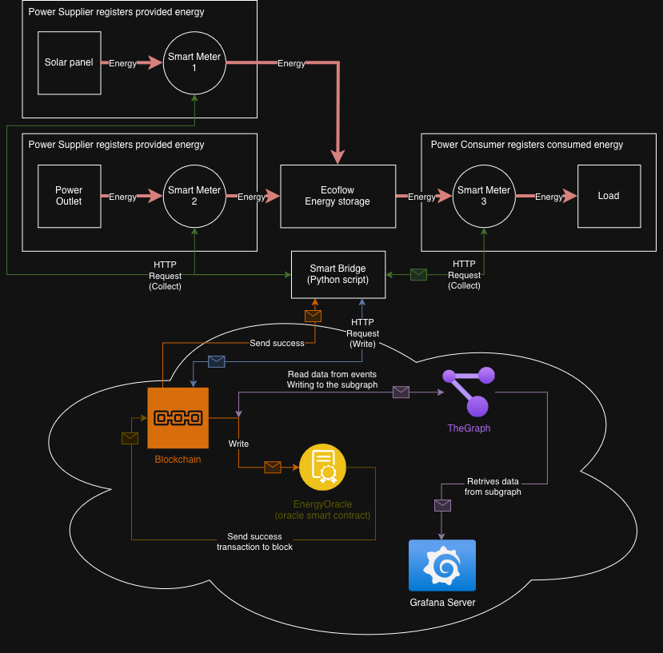

# Architecture



## Contract topology

```
                       ┌──────────────────────┐
                       │        Main          │
                       │  (config registry)   │
                       │  - tokens            │
                       │  - contracts         │
                       │  - fees              │
                       │  - USDC / DAI / USDT │
                       └─────────▲────────────┘
                                 │ reads
       ┌─────────────────────────┼─────────────────────────────┐
       │                         │                             │
┌──────┴──────┐         ┌────────┴────────┐           ┌────────┴────────┐
│   Register  │         │   EnergyOracle  │           │     Escrow      │
│             │         │                 │           │                 │
│ mints/burns │         │ records tariff, │◀──────────│ pulls payment,  │
│ identity    │         │ production,     │  updates  │ pays supplier,  │
│ NFTs        │         │ consumption     │  debt     │ takes fee       │
└──────┬──────┘         └────────┬────────┘           └─────────────────┘
       │                         │
       │ stakes producer         │ mints reward MGT to provider
       ▼                         ▼
┌────────────────┐        ┌──────────────────────────┐
│  StakingReward │        │   Token contracts        │
│  - MGT rewards │        │   NRGCT / MGT / NRGPT /  │
│    per second  │        │   NRGST / NRGOPT / ELCT  │
└────────────────┘        └──────────────────────────┘
```

`Main` is the single source of truth for addresses, fees, and stablecoins.
Every other contract reads its configuration through `main().tokens()`,
`main().contracts()`, and `main().fees()` rather than holding its own copies.

## Lifecycles

### 1. Registration

```
PROTOCOL MANAGER → Register.registerProducer(producer)
       │
       ├── mints EnergyProducerToken (NRGPT) → producer
       └── StakingReward.enterStakingProducer(producerId)

PROTOCOL MANAGER → Register.registerSupplier(supplier)
       └── mints EnergySupplierToken (NRGST) → supplier

PROTOCOL MANAGER → Register.registerOracleProvider(op)
       └── mints EnergyOracleProviderToken (NRGOPT) → op

SUPPLIER         → Register.registerElectricityConsumer(consumer, supplierId)
       └── mints ElectricityConsumerToken (ELCT) → consumer
```

### 2. Data reporting (oracle providers)

Any holder of `EnergyOracleProviderToken` can call these methods on
`EnergyOracle` (contract must not be paused):

| Method                          | Effect                                                                                                            |
| ------------------------------- | ----------------------------------------------------------------------------------------------------------------- |
| `recordSupplierPrice`           | Stores the latest USD price per unit for a supplier. Mints MGT to the reporter.                                   |
| `recordEnergyProductions`       | Stores the producer output. Mints NRGCT to the producer (1 NRGCT per kWh). Mints MGT to the reporter.             |
| `recordConsumerConsumptions`    | Increases consumer debt (`consumption * price`). Burns NRGCT from the supplier. Mints MGT to supplier + reporter. |

### 3. Settlement

```
CONSUMER → Escrow.payForElectricity(supplierId, paymentToken)
       │
       │ paymentToken ∈ { USDC, DAI, USDT }   ← whitelisted on Main
       │
       ├── safeTransferFrom(consumer,       this,        debt + fee)
       ├── safeTransfer    (supplier,                    debt)
       ├── safeTransfer    (feeReceiver,                 fee)
       └── EnergyOracle.updateEnergyConsumptions(consumer, supplierId, 0, debt)
                                                      └── clears debt
```

### 4. Producer rewards

```
PRODUCER → StakingReward.getProducerRewards(producerId)
       └── mints accrued MGT to the producer
           reward = MGT_TO_ORACLE_PROVIDER * elapsedSeconds / totalProducers
```

When a producer is unregistered, `Register.unregisterProducer` calls
`StakingReward.exitStakingProducer` which pays out the final pending reward
and decrements `totalProducers`.

## Key invariants

- A consumer can only pay for a supplier where it holds the matching
  `ElectricityConsumerToken` (id == `supplierId`).
- Payment is only accepted in tokens whitelisted on `Main` (USDC, DAI, USDT).
- Only contracts holding the `ESCROW` role on `EnergyOracle` may mutate
  consumer debt (`updateEnergyConsumptions`).
- Only the `Register` contract may enter/exit producer staking; this is
  enforced by `onlyRegister`.
- All write paths on `EnergyOracle` are gated by `whenNotPaused`; the
  manager can pause to halt data reporting in an incident.

## Physical validation

For how this maps onto a real physical rig — solar panel, smart meters, the
oracle bridge, and the Grafana/Prometheus monitoring pipeline — see
[Laboratory Stand & Telemetry](LabStand.md), including a note on the current
gap between producer and supplier identities (§6) and known deltas between the
demo setup and this codebase (§8).
