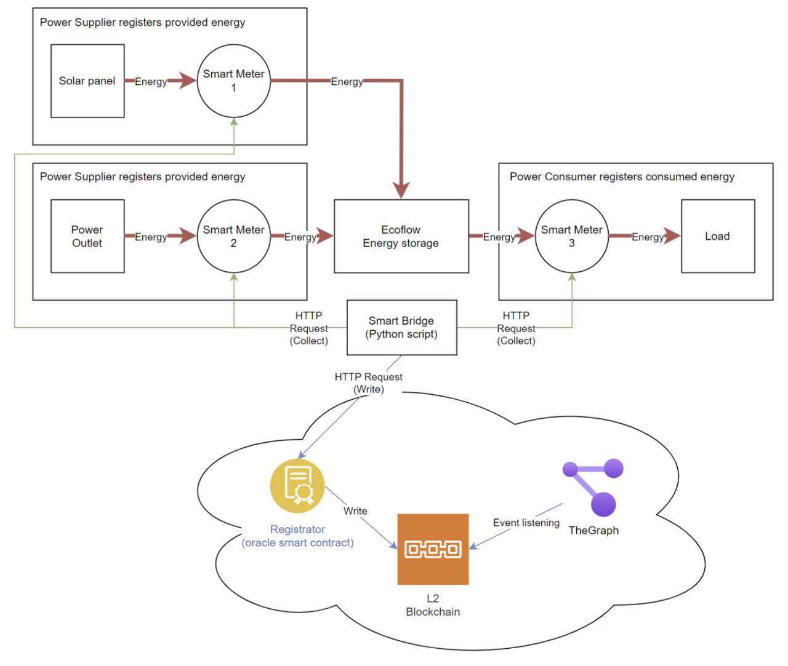
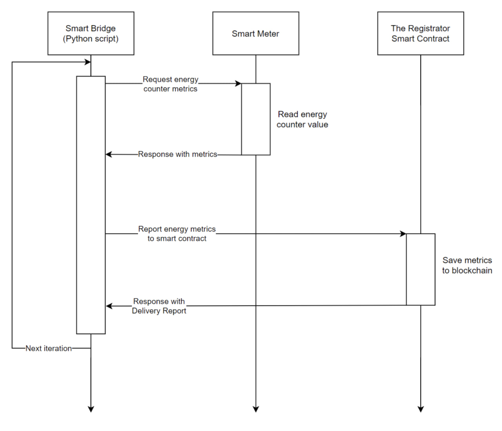
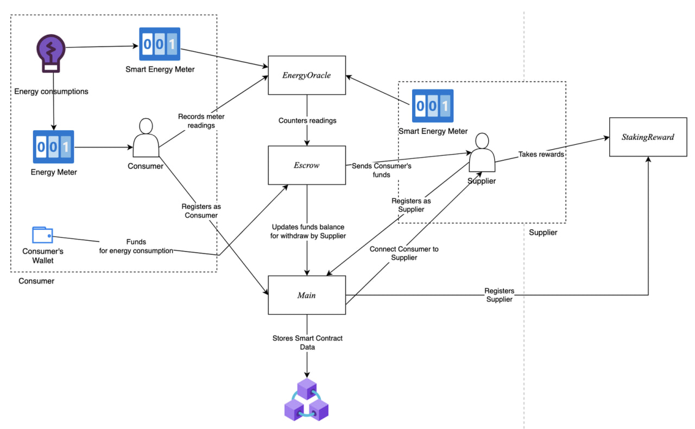
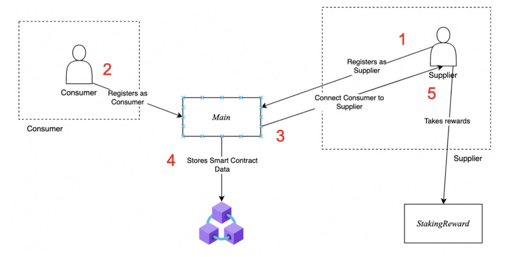
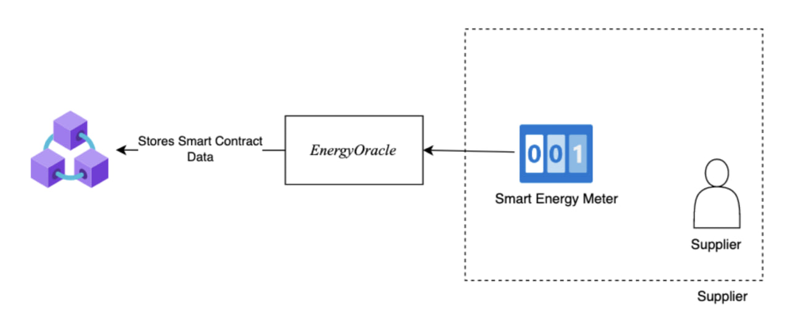
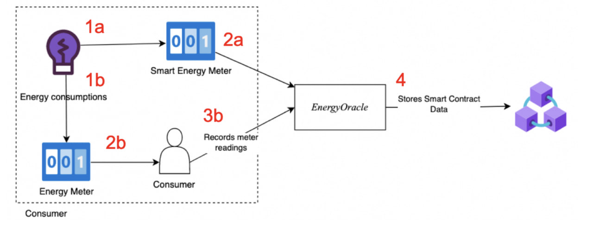
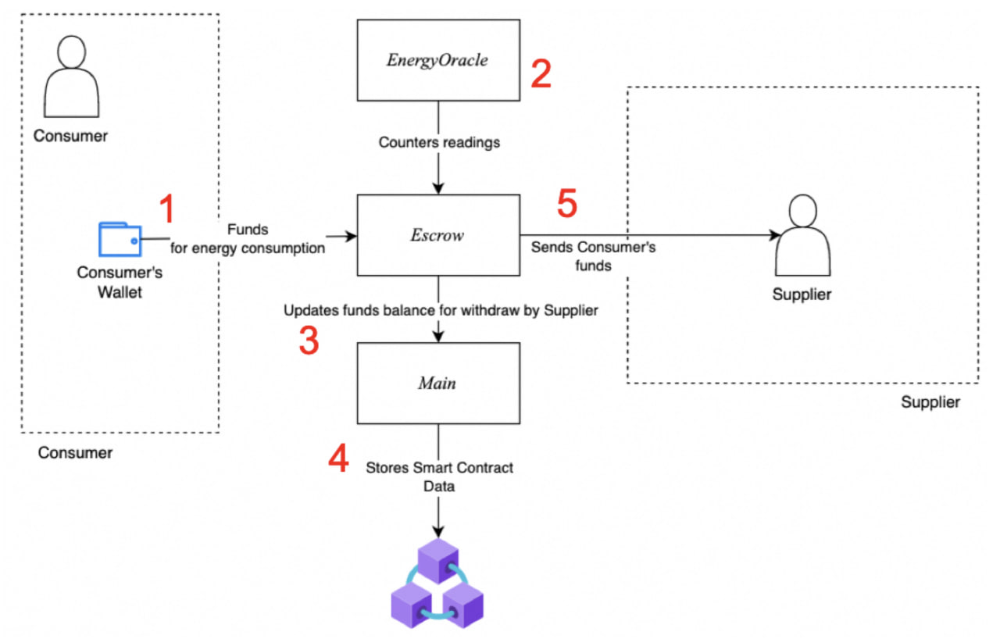
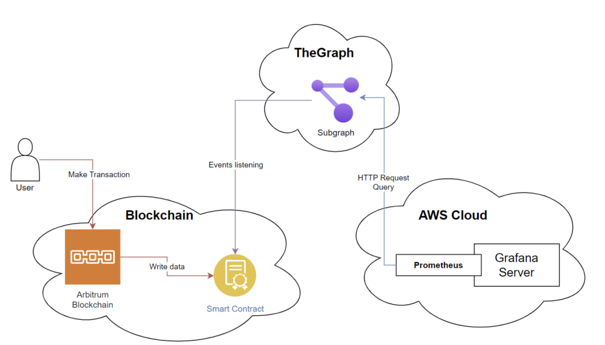

# Laboratory Stand & Telemetry

This page documents the physical laboratory rig used to validate the protocol end
to end — from a real solar panel and smart meters, through the on-chain contracts,
to the Grafana dashboards used for monitoring. It also records where the demo
setup and the current codebase have diverged, so the gap is explicit rather than
implied.

## 1. Overview

The stand simulates a small SmartGrid: a green energy producer (solar panel)
coexists with an energy consumer (a thermal fan heater), and an EcoFlow charging
station stands in for local storage/distribution. Three Wi-Fi smart meters expose
REST APIs; a bridge script polls them and writes the readings to the blockchain
via `EnergyOracle`.

## 2. Components

| Component                  | Role                                                                                   |
| --------------------------- | --------------------------------------------------------------------------------------- |
| EcoFlow Charging Station    | Manages energy flow between sources (solar, grid) and the consumer (heater).           |
| Solar Panel                 | Renewable energy producer.                                                              |
| 3x Smart Meter              | Wi-Fi connected, REST API, report real-time production/consumption at each measurement point. |
| Heater (thermal fan)        | Energy-consuming load — the demand point of the simulated microgrid.                    |
| Smart Bridge Script         | Laptop-resident script that polls the smart meters over REST and forwards readings to the `EnergyOracle` / registrator smart contract. |

## 3. Block schema



Interconnections:

- **Meter 1** — between the public grid and the EcoFlow station; measures grid draw.
- **Meter 2** — between the EcoFlow station and the heater; measures load consumption.
- **Meter 3** — between the solar panel and the EcoFlow station; measures solar production.
- The **Smart Bridge Script** polls all three meters over the lab Wi-Fi network and
  writes the readings on-chain through the oracle/registrator contract.

## 4. Operation sequence



Each polling cycle: the bridge script requests the energy-counter metrics from a
smart meter, receives the reading, reports it to the on-chain contract, and waits
for the delivery confirmation before starting the next iteration.

## 5. Smart contract system dataflow (overview)



This is the full picture the sections below break apart: consumers and smart
meters feed readings into `EnergyOracle`; `Escrow` pulls consumer funds and
updates the balance suppliers can withdraw through `Main`; producers/suppliers
register through `Main` and suppliers claim `StakingReward` rewards. The
following two sections walk through the registration leg and the
consumption/payment legs of this diagram against the current contract code.

## 6. Producer ↔ Supplier interaction (on-chain)

The stand's physical roles ("solar panel produces", "heater consumes") map onto
two **separate, independently registered** on-chain identities — this is worth
calling out because it is easy to assume a producer and a supplier are the same
account when reading the report, and in the current contracts they are not:

- `Register.registerProducer` mints an `EnergyProducerToken` (NRGPT) and enters
  the producer into `StakingReward` — a producer earns MGT purely for having
  registered generation capacity, independent of any supplier relationship.
- `Register.registerSupplier` mints an `EnergySupplierToken` (NRGST). A supplier
  is who consumers pay, whose price an oracle provider records
  (`recordSupplierPrice`), and whose NRGCT balance is burned when a consumer's
  usage is recorded.
- `EnergyOracle.recordEnergyProductions(producerId, production)` **mints NRGCT to
  the producer**.
- `EnergyOracle.recordConsumerConsumptions(consumer, supplierId, consumption)`
  **burns NRGCT from the supplier** and increases the consumer's USD debt.

**Confirmed fact (from `contracts/EnergyOracle.sol` / `contracts/Register.sol`):**
there is no function anywhere in the current contracts that moves NRGCT from a
producer's balance to a supplier's balance. The two mint/burn legs above operate
on whatever address happens to hold each identity token.

**Assumption:** the design intends the common case to be a single actor
registered as both producer and supplier (e.g. a homeowner with solar panels
selling directly to their own consumers) — mirroring the report's Diagram 2,
where "an individual electricity supplier with generation capacities" is
registered as one entity. NRGCT is a plain ERC-20, so a producer *can* transfer
credits to a separate supplier manually, but nothing in `Register`, `EnergyOracle`,
or `Escrow` automates or enforces that hand-off today.

**Open question:** is a producer/supplier marketplace (matching multiple
producers to a supplier, or an on-chain NRGCT transfer step) planned, or is
"one actor, two identities" the intended production model? This determines
whether the missing hand-off is a bug or simply an unbuilt feature.

Registration, consumption-recording, and payment diagrams from the milestone
report, kept here for reference against the current contract behavior:






Diagram 4 ("two options for registering consumed energy") describes: **(a)** a
smart meter writing directly to `EnergyOracle`, and **(b)** an independent
oracle-provider recording readings on a consumer's behalf. Only option **(b)** is
implemented — `onlyOracleProvider` gates every write on `EnergyOracle`, so a
smart meter cannot call the contract itself; a registered oracle-provider
identity (in the lab demo, the Smart Bridge Script's key) always sits in between.

## 7. Telemetry & monitoring pipeline



1. A user submits a transaction that calls one of the smart contracts.
2. The contract call emits one or more events.
3. A subgraph (deployed to [TheGraph](https://github.com/b0gdaniy/defi-energy-supply-subgraph))
   listens for those events on the configured smart contracts.
4. Prometheus queries the subgraph for the indexed data.
5. Grafana, via the Prometheus data source, renders dashboards from that data.

### Local setup

```bash
git clone https://github.com/b0gdaniy/defi-energy-supply-subgraph.git
docker network create monitoring-network
cd grafana-prometheus/
docker-compose up --build
```

The live dashboards and their current URLs are tracked in
[Live Deployment](Deployment.md#quick-links), not duplicated here, since they
rotate (see the tunnel-URL note in that page).

## 8. Known gaps

Comparing the milestone report against the current repository surfaces several
gaps worth tracking explicitly:

- **No producer→supplier NRGCT hand-off on-chain** — see §6 above; a supplier
  needs an NRGCT balance to have consumption burns succeed, and nothing moves
  credits from a producer to a supplier automatically.
- **The Smart Bridge Script itself isn't in this repository.** Only
  `scripts/python/tg-bot.py` (manual Telegram-triggered calls) and
  `scripts/python/simulate.py` (offline generation/consumption simulation) exist;
  the REST-polling bridge described in §1–4 that talks to the physical smart
  meters was not committed here.
- **`scripts/python/tg-bot.py` is stale relative to the live deployment.** It
  hardcodes an old `Main` ABI/address (`0x2a256cc5A4825eb251c68634f39b79C822955b3c`)
  referencing a since-removed `Manager` contract, and points at
  `arbitrum-sepolia.infura.io` — not the current Base Sepolia deployment in
  [Deployment.md](Deployment.md). It would need updating before it could drive
  the live contracts.
- **Open question — network mismatch.** The report's Grafana/TheGraph screenshots
  were taken against an "ArbitrumSepolia" deployment; the project's current live
  deployment (this repo's `README.md` / `docs/Deployment.md`) is on **Base
  Sepolia**. Unclear whether the subgraph/Grafana stack has since been migrated
  to track Base Sepolia, or whether the dashboards shown in the report are now
  stale relative to where the contracts actually live.
- **No end-to-end settlement was demonstrated on the physical stand.** The
  report shows registration and consumption-recording driving the Grafana
  dashboards, but not a consumer `Escrow.payForElectricity` call or a producer
  `StakingReward` claim triggered from the lab rig — the payment/reward legs of
  the flow (§6, payment process diagram) are documented but not exercised in the demo evidence.
- **Architecture evolved since the report was written**, and this should not be
  read as a regression:
  - The report's standalone `Manager` contract is gone; access control is now
    per-contract role-based (`OwnableEnumerableRoles`), rooted in `Main` as the
    config registry (see [Architecture.md](Architecture.md)).
  - The token set grew from the report's three (`MCGR`, `NRGS`, `ELU`) to the
    current six (`NRGCT`, `MGT`, `NRGPT`, `NRGST`, `NRGOPT`, `ELCT`) — splitting
    producer/supplier/oracle-provider into distinct identities instead of one
    combined supplier NFT.
- **Single point of failure in the oracle layer.** Only one Smart Bridge Script
  instance is described, running on one laptop with one key — no redundancy is
  described if it goes offline, and nothing in `EnergyOracle` cross-checks
  readings from multiple independent oracle providers before minting/burning
  NRGCT or updating debt.

## 9. Photos of the real stand

Photos of the physical rig used for this milestone are attached to the original
milestone report (`First Milestone Report.md`) and are not duplicated in this
repository to keep it free of large binary assets unrelated to the codebase.
